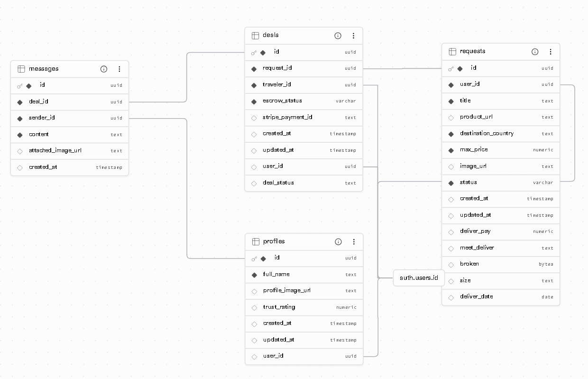

# BringIt ✈️📦
**תאריך:** 18 ביוני 2026

### סקירה כללית
**BringIt** היא פלטפורמה קהילתית (Marketplace) המקשרת בין צרכנים בישראל שרוצים לרכוש מוצרים מוזלים מחו"ל, לבין נוסעים לחו"ל עם מקום פנוי במזוודה. הפלטפורמה מאפשרת ביצוע עסקאות בטוחות ללא חשש מנוכלויות באמצעות מנגנון תשלום בנאמנות (Escrow), שבו צד שלישי אובייקטיבי מחזיק בכסף עבור הצדדים עד להשלמת העסקה לשביעות רצונם [1].

### איזו בעיה הפרויקט פותר?
צרכנים ישראלים נתקלים לעיתים קרובות בעלויות משלוח מופקעות מאתרים בחו"ל או בחוסר אפשרות לשילוח לישראל. הפתרון המקובל כיום — בקשת טובות מאנשים זרים בקבוצות פייסבוק — מלווה בחוסר אמון כבד וסיכון לנוכלויות, שכן אין דרך להבטיח שהכסף יועבר מראש או לחלופין שהמוצר אכן יסופק.

### קהל היעד
* **הקונים:** צרכנים ומשפחות המחפשים לחסוך כסף בהוצאות (על גאדג'טים, ביגוד, ויטמינים וכדומה), הנמצאים במצב בו הם צריכים מוצר מחו"ל ומפרסמים "בקשה למוצר" בלוח הבקשות של האפליקציה.
* **הנוסעים:** ישראלים שטסים לחו"ל ומחפשים להרוויח "כסף כיס" כדי לכסות חלק מעלויות הטיסה באמצעות ניצול משקל פנוי במזוודה.

### מתחרים ובידול
* **המתחרים הקיימים:** קבוצות פייסבוק (כמו "מי טס ל..."), אפליקציות בינלאומיות (כמו Grabr), וחברות שילוח מסחריות.
* **הבידול שלנו (Trust as a Service):** בניגוד לקבוצות פייסבוק שדורשות אמון עיוור, **BringIt מבטיחה ביטחון

🔗 **https://e-project-6vagm9psp-er-project.vercel.app/**  
🔗 **http://erez.run.place/BringIt/**  

